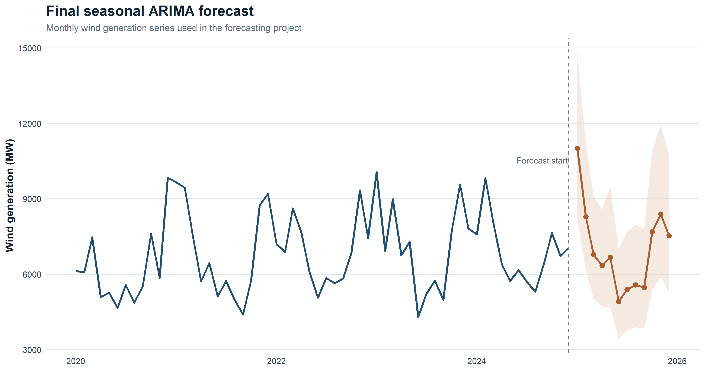

# Time Series Forecasting and ARIMA Modelling

Public repository for an academic forecasting project centered on classical time-series methods for monthly wind-generation modelling.

## Overview

This repository documents a forecasting workflow covering:

- exploratory time-series analysis;
- STL decomposition;
- simple exponential smoothing;
- Holt and Holt-Winters models;
- manual Box-Jenkins reasoning;
- ARIMA and seasonal ARIMA selection;
- `auto.arima` as an automatic benchmark;
- holdout-based evaluation;
- residual diagnostics;
- short-horizon forecasting.

## Academic context

Source coursework folder:

- `MASTER/PRIMER CUATRI/Tecnicas de prevision`

The final local coursework report contained more modelling detail than the first public version of this repository. The repo has therefore been expanded so that it reflects the real structure of the work more faithfully while still avoiding workbook and course-material uploads.

## Repository contents

- `notebooks/wind_generation_spain_forecasting.Rmd`
  Main public report, expanded around the final academic workflow.
- `src/forecasting_helpers.R`
  Helper functions for loading the staged series and computing holdout RMSE.
- `src/modeling_workflow.R`
  Script version of the core modelling workflow.
- `examples/wind_generation_spain_monthly_2020_2024.csv`
  Public-safe monthly series used in the report.
- `examples/inventory_levels_series.txt`
  Small practice series kept as a compact example.
- `examples/seasonal_temperature_series.txt`
  Small seasonal practice series.
- `figures/`
  Public-safe preview figures derived from the staged CSV.
- `docs/`
  Notes on methodology, modelling decisions and publication scope.

## Where to start

1. `notebooks/wind_generation_spain_forecasting.Rmd`
2. `figures/arima_forecast_preview.png`
3. `src/modeling_workflow.R`
4. `docs/model_results_summary.md`

## Modelling structure

The public workflow follows the same general logic used in the final coursework report:

1. Build a monthly series and inspect its trend-seasonality structure.
2. Use STL decomposition to separate long-term and seasonal behaviour.
3. Compare SES, Holt and Holt-Winters as deterministic baselines.
4. Inspect variance stabilization through Box-Cox.
5. Evaluate regular and seasonal differencing needs.
6. Use ACF/PACF and tentative specifications to motivate the ARIMA family.
7. Fit `auto.arima` as a practical benchmark against manual reasoning.
8. Check residual behaviour before generating the final forecast.

## Main takeaways from the coursework folder

- smoothing models already provide a useful baseline for the series;
- Holt-Winters captures the seasonal structure better than SES or Holt alone;
- the final report converges to a seasonal ARIMA structure that is consistent with the `auto.arima` benchmark;
- ARIMA modelling adds a Box-Jenkins interpretation layer through differencing, ACF/PACF reasoning and residual checking;
- the public repo keeps the forecasting logic, even though the original workbook is not published.

## Data availability

The original coursework folder contained lecture PDFs, Word files, templates and Excel workbooks.

This public repository does not publish those course materials wholesale. Instead, it includes a compact CSV derived from the monthly wind-generation series used in the project, plus two very small practice text series that do not contain sensitive information.

## What is intentionally excluded

- lecture PDFs and teacher-provided slides;
- course templates and Word submissions;
- raw Excel workbooks copied blindly;
- local HTML/PDF render outputs from the original course folder;
- logs and intermediate build artifacts.

## Privacy and licensing

No clinical or personal data is included in this repository.

Some source documents from the original coursework may still be subject to teaching-material or redistribution restrictions, which is why they are not bundled here.

## Preview

The most representative visual in the public version is the final seasonal-ARIMA forecast used to summarize the modelling sequence.

Additional context figures, including the full-series overview and the train/holdout split, are kept in `figures/`.

## Suggested execution

From R / RStudio:

1. Open `notebooks/wind_generation_spain_forecasting.Rmd`
2. Ensure the required R packages are installed
3. Knit the document or run the chunks interactively

## Why this project is in the portfolio

Although it is not biomedical, it fits the public profile as a strong data-science project:

- structured statistical modelling;
- clear forecasting logic;
- quantitative evaluation;
- reproducible reporting in R Markdown.

## Additional documentation

- `docs/methodology.md`
- `docs/model_results_summary.md`
- `docs/source_material_inventory.md`
