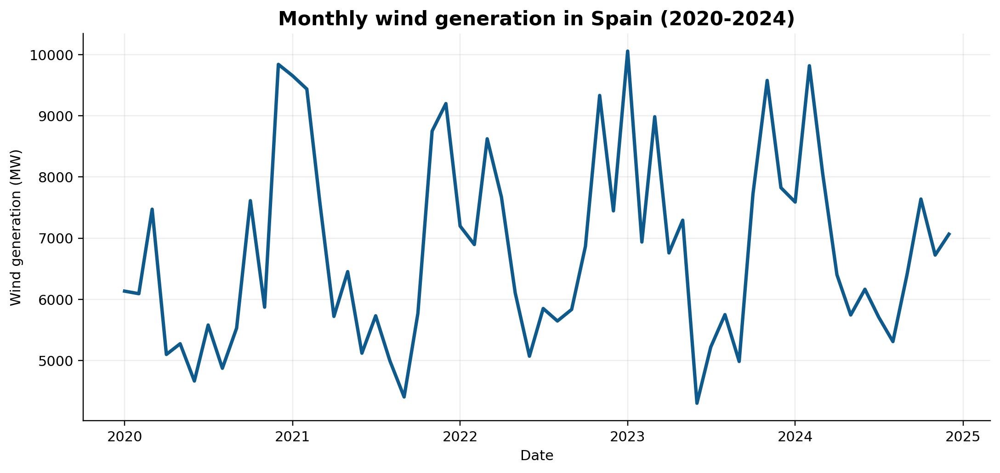
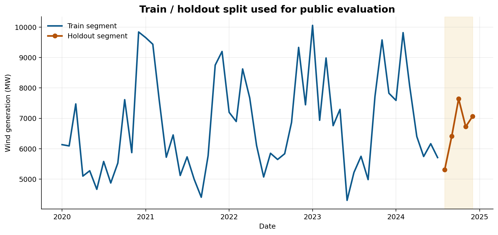

# Time Series Forecasting and ARIMA Modelling

Public portfolio version of an academic forecasting project centered on classical time-series methods for monthly wind-generation modelling.

## Overview

This repository documents a compact forecasting workflow covering:

- exploratory time-series analysis
- exponential smoothing baselines
- Holt and Holt-Winters models
- ARIMA / seasonal ARIMA identification
- holdout-based evaluation
- short-horizon forecasting

The public version is built around a clean monthly series and a simplified R Markdown report so the project remains reproducible without exposing course handouts, Word templates or raw spreadsheets.

## Academic context

Source material audited from:

- `MASTER/PRIMER CUATRI/Tecnicas de prevision`

This portfolio repo is a curated public export prepared from that coursework folder.

## Collaboration note

The original academic report was developed as collaborative coursework. This public repository is the cleaned portfolio version curated by Víctor Rodríguez Albendea from the audited local material.

## Repository contents

- `notebooks/wind_generation_spain_forecasting.Rmd`
  Cleaned report template using a local CSV instead of the original Excel workbook.
- `src/forecasting_helpers.R`
  Lightweight helper functions for loading the series and computing holdout RMSE.
- `examples/wind_generation_spain_monthly_2020_2024.csv`
  Public-safe monthly series used in the staged report.
- `examples/inventory_levels_series.txt`
  Small practice series kept as a simple univariate forecasting example.
- `examples/seasonal_temperature_series.txt`
  Seasonal practice series preserved as a compact example input.
- `figures/`
  Public-safe preview figures derived from the staged monthly series.

## Methods

The staged workflow focuses on a practical modelling sequence:

1. Visualize the series and inspect seasonal structure.
2. Compare smoothing-based baselines on a short holdout split.
3. Stabilize variance where needed and inspect stationarity.
4. Fit ARIMA-style models under a Box-Jenkins mindset.
5. Evaluate the selected model through holdout error and residual diagnostics.

## Data availability

The original coursework folder contained lecture PDFs, Word files, templates and Excel workbooks.

This public repository does **not** publish those course materials wholesale. Instead, it includes a compact CSV derived from the monthly wind-generation series used in the project, plus two very small practice text series that do not contain sensitive information.

## What is intentionally excluded

- lecture PDFs and teacher-provided slides
- course templates and Word submissions
- raw Excel workbooks copied blindly
- local HTML/PDF render outputs from the original course folder
- logs and intermediate build artifacts

## Privacy and licensing

No clinical or personal data is included in this repository.

Some source documents from the original coursework may still be subject to teaching-material or redistribution restrictions, which is why they are not bundled here.

## Preview

## Suggested execution

From R / RStudio:

1. Open `notebooks/wind_generation_spain_forecasting.Rmd`
2. Ensure the required R packages are installed
3. Knit the document or run the chunks interactively

## Why this project is in the portfolio

Although it is not biomedical, it fits the public profile as a strong data-science project:

- structured statistical modelling
- clear forecasting logic
- quantitative evaluation
- reproducible reporting in R Markdown

